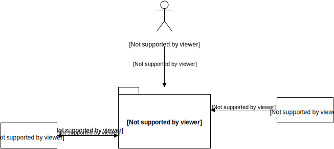

## Kontextabgrenzung

### Externe Schnittstellen

**Web GUI**: Anzeige- und Bearbeitungsmöglichkeiten für die Benutzenden.

**Mail Server**: Senden von Benachrichtigungen via E-Mail sowie empfangen und weiterleiten von 
E-Mails an in der Applikation definierte Mailinglisten. Konfiguration erlaubt SMTP oder Sendmail 
zum Senden sowie POP3 oder IMAP zum Empfangen von E-Mails.

**REST Clients**: Ausgabe von Personen- und Gruppendaten via JSON REST API. Momentan sind noch 
keine Bearbeitungsaktionen möglich.

**Mailchimp**: Integration für Massenmailing

**Oauth oder OIDC**: Identity Provider für weitere Applikationen
