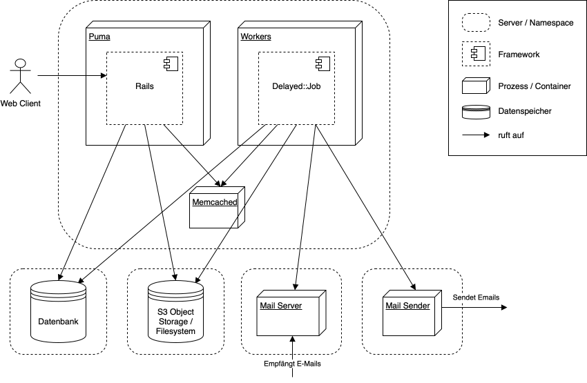

## Verteilungssicht

Die als eigenständige Server zusammengefassten Komponenten stellen die Verteilung bei Puzzle dar. 
Diese muss nicht zwingend so aufgeteilt werden.

**Passenger**: Web Applikationscontainer, welcher die Ruby on Rails Rack Applikation enthält. Nimmt 
Anfragen von Web Clients entgegen und beantwortet diese. Kann eigenständig oder als Apache HTTPD 
Module laufen.

**Workers**: Ein oder mehrere Worker Prozesse, welche die `Delayed::Jobs` abarbeiten. Die Jobs 
werden vom Rails Prozess in der Datenbank persistiert und zu gegebenen Zeitpunkt von Delayed::Jobs 
wieder geladen und ausgeführt. Workers laufen in der Regel auf dem Hauptserver.

**Memcached**: In-Memory Store, welcher zum Caching bestimmter Daten verwendet wird. Läuft in der 
Regel auf dem Hauptserver.

**Dateisystem**: Hochgeladene Bilder werden im Filesystem abgelegt und von dort wieder über den 
Webserver publiziert. Entspricht in der Regel dem Filesystem des Hauptservers.

**Datenbank**: Relationale Datenbank für alle persistenten Daten. In der Regel eine MySQL Datenbank, 
welche auf einem separaten Server läuft.

**Sphinx**: Full-Text Search Engine. Wird von der Rails Applikation abgefragt. Ein Worker Job 
aktualisiert regelmässig die Indizes aufgrund des aktuellen Datenbankinhaltes. Läuft auf dem 
Hauptserver.

**Mail Sender**: Beliebiger Mail Sender Prozess, welcher für das Versenden von E-Mails verwendet 
wird. Die meisten E-Mails werden aus den Workers heraus gesendet. In der Regel Sendmail oder SMTP, 
welches auf dem Hauptserver läuft.

**Mail Server**: Ein beliebiger Mail Server, welcher eingehende E-Mails an beliebige Adressen einer 
Domain über Pop3 oder IMAP abrufbar macht. Wird für die Mailing Listen verwendet, welche die E-Mails 
regelmässig von den Workers aus abrufen und weiterleiten. Der ursprüngliche E-Mail Empfänger Name 
(z.B. *my_list* bei my_list@mydomain.example.com) wird vorteilhafterweise in einen speziellen Header 
(z.B. `X-Original-To`) gesetzt, damit ein E-Mail korrekt einer Mailing Liste zugeordnet werden kann. 
Läuft in der Regel auf einem separaten Server.

**Airbrake**: Externer Service, welcher in einem Fehlerfall mit allen wichtigen Informationen 
benachrichtigt wird. Ist im Diagram nicht dargestellt. In der Regel eine 
[Errbit](http://errbit.github.io/errbit/) Instanz.
