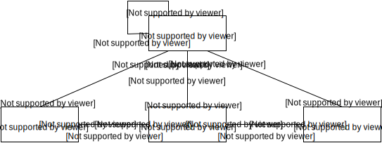

## Konzepte

### Fachliche Strukturen

Diese Sicht zeigt die Hauptmodelle in hitobito. Ein vollständiges und aktuelles Datenmodell kann mit 
dem Befehl `rake erd` generiert werden.

**Group**: Modelliert die Baumstruktur der Gruppen eines Verbandes. Die konkreten Gruppentypen 
werden als Subklassen von den jeweiligen Verbandsplugins definiert und mittels 
[Single Table Inheritance](http://api.rubyonrails.org/classes/ActiveRecord/Inheritance.html) 
persistiert. Verschiedene Klassenattribute können zur Spezifizierung eines Gruppentyps herangezogen 
werden, wie beispielsweise die jeweils erlaubten Rollentypen. Die Baumstruktur ist als 
[Nested Set](http://de.wikipedia.org/wiki/Nested_Sets) persistiert. Es wird unterschieden zwischen 
einfachen Gruppen und Ebenen/Layer. Ebenen bilden jeweils einen Berechtigungsbereich.

**Person**: Eine Person kann mehrere Rollen in mehreren Gruppen haben (via `Role`), an verschiedenen 
Events teilnehmen (via `Event::Participation`) und bei mehreren `MailingLists` angemeldet sein (via
`Subscription`). Jede Person kann ein Login haben, die Rollen bestimmen ihre Berechtigungen. 
Änderungen an personenspezifischen Daten werden mit 
[Paper Trail](https://github.com/airblade/paper_trail) aufgezeichnet. Personen können sowohl 
natürliche wie auch juristische (Firmen) sein.

**Event**: Ein einfacher Anlass, ein Kurs oder beliebiger weiterer verbandspezifischer Event. Dieser
kann von mehreren Gruppen durchgeführt werden. Die Eventtypen werden wie die Gruppen über 
Klassenattribute spezifiziert und mittels 
[Single Table Inheritance](http://api.rubyonrails.org/classes/ActiveRecord/Inheritance.html) 
persistiert. Kurse verfügen darüber hinaus noch über eine Kursart und damit über 
Qualifikationseigenschaften.

**MailingList**: Jede Gruppe kann beliebig viele Abos haben, welche optional eine E-Mail Adresse 
haben und dadurch ebenfalls als E-Mail Liste verwendet werden können. Einzelne Personen, jedoch auch 
bestimmte Rollen einer Gruppe oder Teilnehmende eines Events können Abonnenten sein.

### Wagons

Die Applikation ist aufgeteilt in Core (generischer Teil) und Wagons (Verbandsspezifische 
Erweiterungen). Zur Funktionsweise von Wagons allgemein siehe auch 
[wagons](http://github.com/codez/wagons). Falls die Applikation für weitere Verbände customized 
werden soll, können einfach weitere Wagons erstellt werden.

In einem Wagon können Tabellen um weitere Attribute ergänzt werden, Funktionalitäten, Berechtigungen
und Darstellungen angepasst und hinzugefügt werden.

### Group- and Roletypes

Hitobito has a powerful Metamodel to describe organizational structures. Groups always hava a specific `group type` and are organized in a tree. Every group `group type` can a several defined `role types`.

The core of hitobito does not contain any **Role or Group Types**. You have to define them in a wagon [example for a generic structure](https://github.com/hitobito/hitobito_generic). This describes the organizational structure.

An example of a group type definition:

    class Group::Layer < Group
      self.layer = true

      children Group::Layer, Group::Board, Group::Basic
      self.default_children = [Group::Board]

      class Leader < Role
        self.permissions = [:layer_full, :contact_data]
      end

      class Member < Role
        self.permissions = [:group_read]
      end

      class External < Role
        self.permissions = []
        self.visible_from_above = false
        self.kind = :external
      end

      self.default_role = Member
      roles Leader, Member
    end

Line by Line explanation

    class Group::Layer < Group

A group type inherits from the class `Group`.

      self.layer = true

It can be declared as a layer, which contains several subgroups that create a defined space for permissions.
This includes all subgroups of that group. Unless they are declared as layers themselves.

      children Group::Layer, Group::Board, Group::Basic

This assigns all allowed subgroups (`Group::Layer, Group::Board, Group::Basic`). 
You will only be able to create this type of group under the `Group::Layer`.
As you can see in this example, group types can be organized recursively.

      self.default_children = [Group::Board]

Whenever a group of this type is created, it automatically creates groups from the list.

      class Leader < Role
        self.permissions = [:layer_full, :contact_data]
      end

Role types can be declared directly in the Group class. They belong to the class `Role`. 
Every Role Type has a list of permissions (`self.permissions = [:layer_full, :contact_data]`).
All the actions a User can do will be derived from these role permissions, depending on where a user is assigned in which role will give him the associated permissions.

    class External < Role
      self.permissions = []
      self.visible_from_above = false
      self.kind = :external
    end

Permission can also be empty, but a user will always be able to change his own contact details.

You can reduce the visiblity of roles from layers above by using `self.visible_from_above = false`.
This means that this role is not visible to peple from above layers, 
even if they have the general permission to see people from layer below them.

A Roletype can additional be of a specific kind `self.kind = :external` which is used in certain views to differentiate between different kinds of role. The core defines the following kinds: `[:member, :passive, :external]`. But this has no influence on permissions.

      self.default_role = Member

After the declaration of the Roles, you can select one to be automatically selecte when you try assign a role to someone in this kind of group. Useful for groups, where you usually add contacts of the same kind (such as active members, or contacts.)

      roles Leader, Member

Define which roles are actually available to be assigned.

### Berechtigungen

Das Berechtigungssystem definiert, ob ein Benutzer eine spezifische Aktion aufrufen darf oder nicht. 
Dafür sind die jeweiligen Rollen sowie deren zugeordnete Grundberechtigungen / Permissions relevant. 
Diese sind allgemeine Angaben für ein Was und Wo, auf welchen die konkreten Berechtigungen aufbauen. 
Eine Permission soll immer einen ganzen Bereich von Aktionen abdecken, nie nur eine einzelne. 

Folgende Permissions existieren momentan:

**admin**: Administration von applikationsweiten Einstellungen wie Kursarten oder Etikettenformate.

**layer_and_below_full**: Alles Lesen und Schreiben auf dieser Ebene und allen darunter liegenden 
Ebenen. Erstellen von Anlässen und Abos (Mailinglisten) auf dieser Ebene.

**layer_and_below_read**: Alles Lesen auf dieser Ebene und allen darunter liegenden Ebenen.

**layer_full**: Alles Lesen und Schreiben auf dieser Ebene. Erstellen von Anlässen und Abos 
(Mailinglisten) auf dieser Ebene.

**layer_read**: Alles Lesen auf dieser Ebene.

**group_and_below_full**: Lesen und Schreiben auf dieser und allen darunter liegenden Gruppen (ohne 
Ebenen). Inkl. Erstellen von Anlässen und Abos (Mailinglisten).

**group_and_below_read**: Lesen auf dieser und allen darunter liegenden Gruppen (ohne Ebenen).

**group_full**: Lesen und Schreiben nur auf dieser Gruppe. Erstellen von Anlässen und Abos 
(Mailinglisten) auf der Gruppe.

**group_read**: Lesen nur auf dieser Gruppe.

**contact_data**: Lesen der Kontaktdaten aller anderen Personen mit Kontaktdatenberechtigung.

**approve_applications**: Bestätigen der Kursanmeldungen für Personen dieser Ebene.

**impersonation**: Darf andere Accounts temporär übernehmen, z. B. für Support Aufgaben oder für Tests.

**finance**: Erlaubt auf der eigenen Ebene Rechnungen zu erstellen und einzusehen.

Die Definition von Berchtigungen geschieht in sogenannten _Abilities_. Diese verknüpfen ein Modell 
sowie die zugehörigen Aktionen mit den entsprechenden Permissions, wobei durch sogenannte 
_Constraints_ alle Details geregelt werden. Constraints sind nichts anderes als sprechende Methoden, 
welche aufgrund Modelleigenschaften und Benutzerrollen die genauen Bedingungen der Berechtigung 
festlegen. Dies sieht wie folgt aus:

    on(Person) do
      permission(:group_full).may(:update).in_same_group
    end
    
    def in_same_group
      roles_with_permission = user.roles.select {|r| r.permissions.include?(permission) }
      (roles_with_permission.collect(&:group_id) & subject.group_ids).present?
    end

Diese Deklaration erteilt einer Rolle mit der Permission `:group_full` die Berechtigung, die 
`update` Aktion auf einer `Person` auszuführen, falls diese `in_same_group` ist. Hier prüft z.B. die 
Constraint `in_same_group`, dass die Person (`subject`) in der selben Gruppe wie die Benutzerrolle 
mit der zugehörigen Permission sein muss. Zur Deklaration von Berechtigungen sind zusätzlich die 
beiden abstrakten Permissions `any` und `general` verfügbar. `any` trifft auf alle Benutzenden 
unabhängig ihrer Permissions zu. Damit können für alle Benutzer geltende Berechtigungen definiert 
werden oder, in der Constraint, Einschränkungen nach spezifischen Rollentypen unabhängig ihrer 
Permissions vorgenommen werden. Die abstrakte Permission `general` wird _zusätzlich_ zu allen 
anderen Berechtigungsdeklarationen dieser Aktion ebenfalls geprüft. Die Aktionen entsprechen 
denjenigen von [CanCanCan](https://github.com/CanCanCommunity/cancancan/wiki/Defining-Abilities), 
Aliase wie `manage` oder `read` sind ebenfalls möglich. Von allen definierten Berechtigungen muss 
mindestens eine Constraint erfüllt sein, damit ein Benutzer die gewünschte Aktion ausführen kann.

Jede neu implementierte Aktion erfordert in der Regel eine neue Berechtiungsdeklaration. Diese 
sollte möglichst auf den bestehenden Constraints und Permissions aufbauen. Ansonsten können neue 
Constraints dafür definiert werden, neue Permissions sind äusserst zurückhaltend einzuführen.

Folgende zwei Rake Tasks helfen bei der Dokumentation der Rollen und Berechtigungen:

    rake hitobito:roles

Gibt alle Gruppen und zugehörigen Rollen und deren Grundberechtigungen aus. Strukturierung nach 
Ebene, Gruppen, Rollen und Permissions. Globale Gruppen können bei jeder Gruppe als Untergruppe 
erstellt werden, Globale Rollen (Global Global) sind bei allen Gruppen verfügbar.

    rake hitobito:abilities

Gibt alle Berechtigungen entsprechend den Permissions aus. Übersicht über die Definition der 
Berechtigungen, welche ein Benutzer benötigt, um eine bestimmte Aktion auf einem bestimmten Modell 
auszuführen.

Lesebeispiel am Beispiel Jubla: _Kann ein Mitglied der Bundesleitung einen Anlass einer Schar 
bearbeiten?_

* Ein Mitglied der Bundesleitung hat die Permissions `[:admin, :layer_and_below_full, 
:contact_data]`.
* Bearbeiten (`update`) eines Events erfordert `any/for_leaded_events`, `group_full/in_same_group`, 
`layer_and_below_full/in_same_layer_or_below` sowie die allgemeine Constraint 
`at_least_one_group_not_deleted_and_not_closed_or_admin`.
* Der Anlass einer Schar ist unterhalb der Ebene Bund des Bulei Mitglieds, somit kommt 
`layer_and_below_full/in_same_layer_or_below` zum Zug.
* Die allgemeine Constraint wirkt in jedem Fall. Falls die Schar also nicht gelöscht ist 
(`at_least_one_group_not_deleted_and_not_closed_or_admin`), kann dieser Benutzer den Anlass 
bearbeiten. (Das `not_closed_..` trifft nur auf Kurse zu).

### Anlässe und Kurse

Anlässe sind ähnlich wie Gruppen immer von einem bestimmten Anlasstyp. Jeder Gruppentyp definiert, 
welche Anlasstypen in einer jeweiligen Gruppe erstellt werden können. Ein Anlass kann neben 
Grundinformationen mehrere Daten (`Event::Date`) und beliebige Zusatzangaben (`Event::Question`) 
definieren, welche die Teilnehmenden bei der Anmeldung angeben müssen (`Event::Answer`). Eine 
Person, welche an einem Anlass teilnimmt (`Event::Participation`), kann dort mehrere Rollen 
(`Event::Role`) inhaben. 

Der Anlasstyp bestimmt die möglichen Rollentypen, welche die Teilnehmenden eines Anlasses haben 
können. 

Ein Anlass-Rollentyp definiert ähnlich wie ein Gruppen-Rollentyp Grundberechtigungen 
(`permissions`), allerdings nur spezifisch für den jeweiligen Anlass. Folgende sind in hitobito 
definiert:

**event_full**: Darf den Anlass bearbeiten.

**participations_full**: Sieht alle Informationen der Teilnehmenden und darf die Teilnahmedaten 
bearbeiten.

**participations_read**: Sieht die öffentlichen Informationen der Teilnehmenden.

**qualify**: Darf den Teilnehmenden eines Kurses die definierten Qualifikationen vergeben.

Ein Rollentyp ist von einer spezifischen Art, welche an gibt, was die Funktion im Anlass ist. 
Hitobito definiert die Arten Leiter/-in, Helfer/-in und Teilnehmer/-in. Die Art wird unter anderem 
verwendet bei der Unterteilung in Leitungsteam und Teilnehmende und hat keinen Einfluss auf die 
Berechtigungen.

Ein Anlass kann selber auch von einer spezifischen Art sein. Dies wird bei den Kursen verwendet, 
welche einer bestimmten Kursart (`Event::Kind`) zugeordnet sind. Über die Kursart werden 
Aufnahmebedingungen sowie die erteilten und verlängerten Qualifikationsarten (`QualificationKind`) 
definiert.

Weiter kann konfigurativ definiert werden, ob ein Anlass Anmeldungen unterstützt. Damit kommt die 
Möglichkeit, Personen zuzuweisen oder abzulehnen sowie an andere, ähnliche Anlässe zu verweisen. 
Falls Anmeldungen unterstützt werden, kann eine Teilnahme (`Event::Participation`) aktiviert sein 
oder nicht. Sonst ist sie immer aktiv.

### Mailing Listen / Abos

siehe [Mailing Listen / Abos](https://github.com/hitobito/hitobito/tree/master/doc/e-mail)

### Single Table Inheritance

Verschiedene Modelle in hitobito verwenden 
[Single Table Inheritance](http://api.rubyonrails.org/classes/ActiveRecord/Inheritance.html), z.B. 
`Group`, `Role` und `Event`. Dabei werden verschiedene Ruby Klassen, welche alle von der selben 
Hauptklasse erben, in einer Tabelle gespeichert. Nicht alle Subklassen müssen dabei alle in der 
Tabelle vorhandenen Spalten verwenden. Zur Dokumentation wie auch zum Bestimmen, welche Attribute 
angezeigt werden sollen, werden die verwendeten Spalten in der jeweiligen Klassenvariable 
`used_attributes` angegeben.
