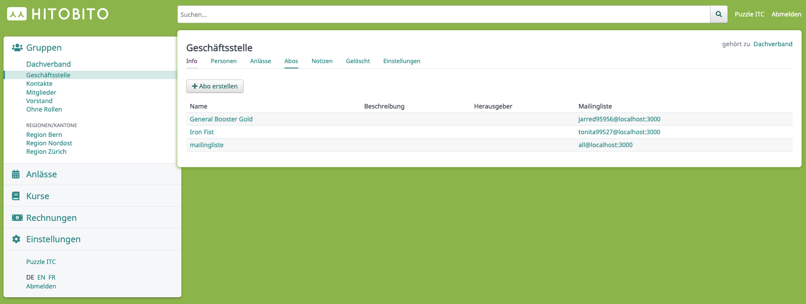
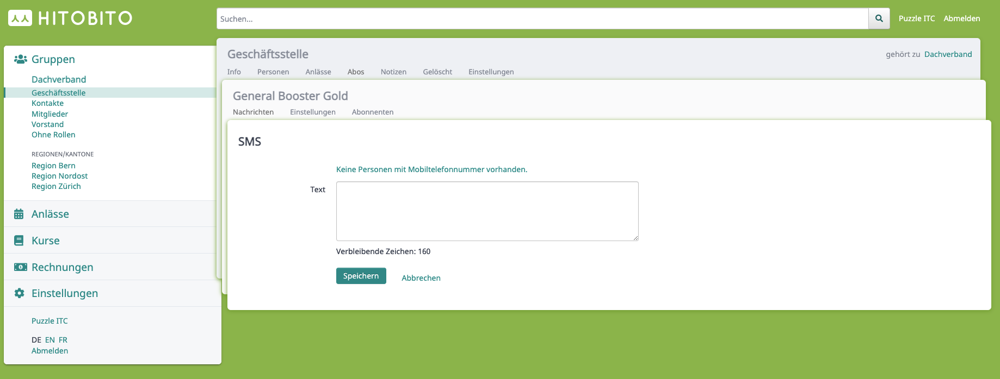
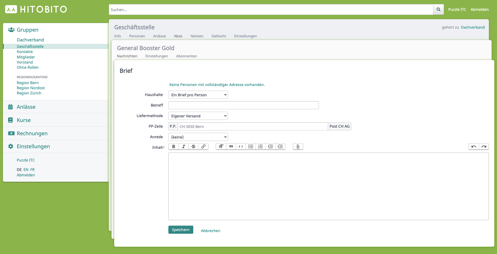
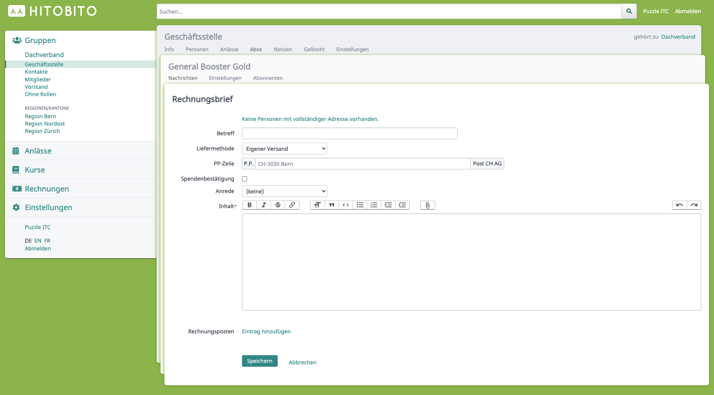

# Messages

_Systemübersicht._

Mit Hitobito können Nachrichten (Briefe, SMS, Mails, usw...) via Abos an verschiedene Empfänger gesendet werden.

## Abo

_Klassendiagramm des Abos._

_Ansicht der Abos einer Gruppe_

### `Person` Model
Person ist das zentrale Model in Hitobito für Personen und Firmen. Auf der Person sind auch die für das Message Modul relevanten Kontaktdaten wie E-Mail, Telefonnummer oder Postadresse gespeichert.

### `MailingList` Model
Das Abo (MailingList) ist eines der zentralen Elemente im Messages Modul. Mit Subscriptions werden die Empfänger auf einem Abo definiert. Subscribers können Gruppen und spezifische Rollen aber auch einzelne Personen sein.

### `MessageRecipient` Model
Der `MessageRecipient` wird im `Dispatch` erstellt, sobald eine Message versendet wird. Dieser besteht aus den Personen und der Nachricht welche versendet werden. Jeder `MessageRecipient` erhält zudem einen Status, in welchem man den jeweiligen Status des Versands einsehen kann. Sollte ein Versand fehlschlagen, kann mithilfe des Status eingesehen werden, welche Personen eine Nachricht noch nicht erhalten haben.

## Message

_Klassendiagramm der Messagetypen_

Das Message Model definiert die verschiedenen Message Typen von Hitobito (Single Table Inheritance [STI](https://api.rubyonrails.org/classes/ActiveRecord/Inheritance.html)):

| STI Model              | Beschreibung |
|------------------------|-------------------|
| `Message::TextMessage` | Textnachricht (SMS) |         
| `Message::Letter`      | Brief |         
| `Message::LetterWithInvoice` | Rechnungsbrief |         
| `Message::BulkMail` | Mail |         

### `Message::TextMessage`

_Ansicht einer neuen SMS Nachricht_

Dieser Typ ist eine SMS (Textnachricht) und wird an eine Person versandt wenn diese eine Nummer vom Typ Mobil hat.

### `Message::Letter`

_Ansicht eines neuen Briefes_

Brief für den Postversand welcher als PDF gerendert wird.

### `Message::LetterWithInvoice`

_Ansicht eines neuen Rechnungsbriefes_

Briefe mit zusätzlichen Rechnungsoptionen (Rechnungsposten).

### `Message::BulkMail`
Mailnachricht welche über ein externes Mailprogramm an ein Abo gesendet wird.

## Versand (Dispatch)
Der Dispatcher ist dafür zuständig den entsprechenden Nachrichtentyp zu versenden.

### `Messages::DispatchJob`
Der für alle Message Typen generische DispatchJob (DelayedJob) wird für den Versand der Nachrichten verwendet.

### `TextMessageDispatch`
Beim Versand via SMS werden als erstes alle Empfängernummern gesammelt und in den MessageRecipients abgelegt. Danach erfolgt der Versand über eine HTTP Api von Aspsms. Kurze Zeit später werden die Empfangsbestätigungen via einem seperaten HTTP Api Aufruf geholt und die MessageRecipient entsprechend mit Status aktualisiert.

### `LetterDispatch`
Generiert alle MessageRecipient Einträge mit der Post Adresse der Empfänger. Auf Basis dieser Einträge wird dann ein entsprechendes PDF generiert.

### Druckerei
Eine Druckerei hat einen eigenen Zugang zu Hitobito und somit die Möglichkeit Briefe für den Versand als PDF herunterzuladen.
