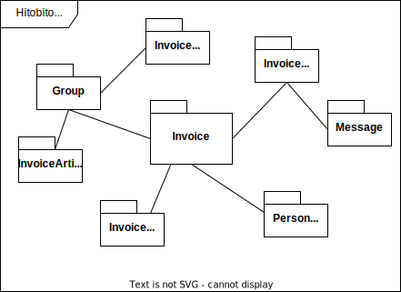
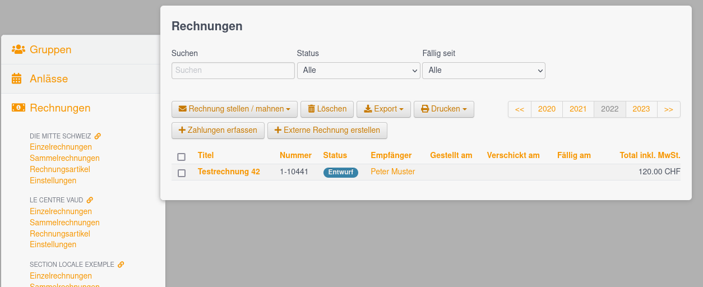
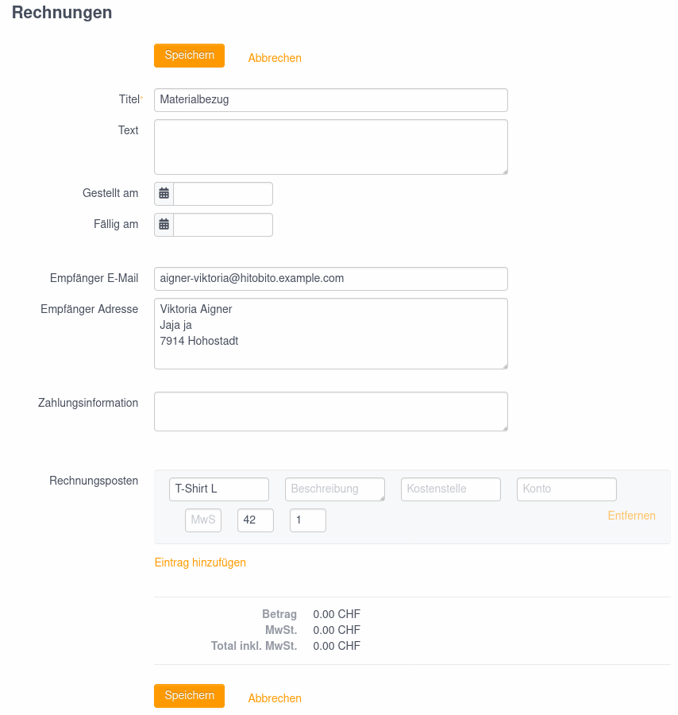
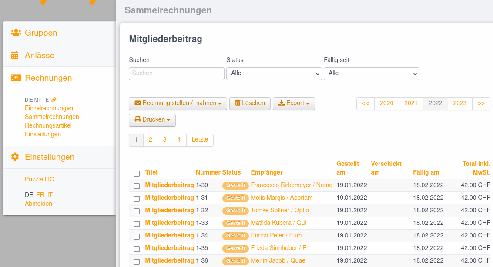

# Invoices

Mit dem Rechnungsfeature von Hitobito können Rechnungen an Personen und Firmen gestellt werden. 

## Benutzer

Damit eine Person das Rechnungsfeature nutzen kann, muss sie auf einem Layer/Gruppe eine Rolle mit :finance Permission haben. In einigen Wagons wird diese Rolle 'Kassier/In' genannt.

Rechnungen werden an Personen/Firmen gestellt und können über folgende Workflows erstellt werden:

* Auf der Personenliste einer Gruppe über den Button '+ Rechnung erstellen'. Es wird für jede Person innerhalb der Gruppe eine Rechnung erstellt.
* Auf der Personenseite (Person#show) über den Button '+ Rechnung erstellen'. Die Rechnung wird nur an die ausgewählte Person gestellt.
* Via Abo und Rechnungsbriefe. Es wird eine Sammelrechnung für alle Empfänger des Abos mit gültiger Adresse erstellt.

## `Invoice`

Das zentrale Model repräsentiert die Rechnung selber, gehört zu einer Gruppe sowie einem Person-Entry und beinhaltet eine oder mehrere Rechnungspositionen (`InvoiceItem`).

## `InvoiceConfig`

Die Verwaltung der Rechnungseinstellungen erfolgt pro Layer und sind in der Hauptnavigation unter **Rechnungen** zu finden. Hier können Einstellungen wie z.B. Absender Adresse, Kontoangaben und Mahntexte vorgenommen werden. 

## `InvoiceArticle`

In der Hauptnavigation unter **Rechnungen** können die Rechnungsartikel verwaltet werden. Diese Artikel können dann beim Erstellen einer Rechnung eingefügt werden.

## `InvoiceList`

Sammelrechnungen dienen dazu eine Rechnung an mehrere Personen zu erstellen. Die erstellten Sammelrechnungen sind in der Hauptnavigation unter **Rechnungen** zu finden. 

### `Message::LetterWithInvoice`

Neben Briefen können für Abos (MailingList) [Rechnungsbriefe](01_messages.md#messageletterwithinvoice) für die Empfänger erstellt werden. Der `Message::LetterWithInvoice`-Eintrag wird dabei mit einer Sammelrechnung `InvoiceList` verknüpft.
