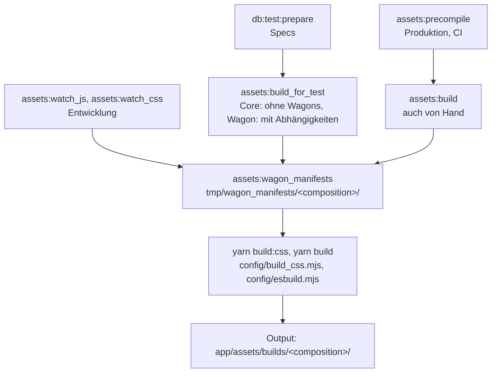

## Frontend & Assets

hitobito bindet JavaScript files, Stylesheets, Bilder und Fonts über [Propshaft](https://github.com/rails/propshaft)
(die Asset Pipeline von Rails) ein. Die eigentliche Kompilation übernehmen [esbuild](https://esbuild.github.io/)
für JavaScript und [dart-sass](https://sass-lang.com/dart-sass/) für SCSS, beide über yarn-Skripte in
`package.json`, die von rake-Tasks aufgerufen werden. Propshaft selbst kompiliert nichts - es
fingerprinted und liefert einfach aus, was in `app/assets/builds` liegt.

### Funktionsweise

Die Entrypoints liegen in `app/javascript/entrypoints/*.js` bzw.
`app/assets/stylesheets/entrypoints/*.scss`, der restliche Quellcode in `app/javascript/**` bzw.
`app/assets/stylesheets/hitobito/**`.

Kompiliert wird nach `app/assets/builds/<composition>`, von wo Propshaft die Dateien wie jede andere
unter `app/assets/*` fingerprinted ausliefert. `<composition>` ist die aktive Wagon-Zusammenstellung
(`WagonAssetsHelper.composition`, z.B. `pbs-youth` oder `core`). Ein Unterverzeichnis pro
Composition verhindert, dass sich die Builds verschiedener Kunden oder der Build für die Specs und der
für die laufende App gegenseitig überschreiben.

#### Der Build

Jeder Build läuft gleich ab, egal woher er angestossen wird (alles in `lib/tasks/assets.rake`):

1. `assets:wagon_manifests` schreibt nach `tmp/wagon_manifests/<composition>/` zwei JSON-Dateien mit
   den Stylesheet-Verzeichnissen bzw. den JS-relevanten Dateien der Wagons dieser Composition und
   übergibt dieses Verzeichnis den Node-Skripts als `WAGON_MANIFEST_DIR`.
2. `yarn build:css` führt `config/build_css.mjs` aus: dart-sass bekommt die Wagon-Verzeichnisse als
   `--load-path` und kompiliert alle Entrypoints, auch die wagon-eigenen.
   `yarn build` führt `config/esbuild.mjs` aus: esbuild generiert aus dem Manifest bei jedem Build
   explizite Import-Listen (Wagon-Skripte, Core-Module, Stimulus-Controller) und stellt sie als
   virtuelle Module unter `app/javascript/generated/` bereit, die in den Core-Entrypoints importiert
   werden.

yarn läuft dabei immer im Core-Verzeichnis. Darum funktionieren die Tasks auch aus einem
Wagon-Verzeichnis, wo sie das Präfix `app:` tragen (`app:assets:build`). yarn direkt aufzurufen
funktioniert nicht, weil dann das Manifest fehlt.

#### Wann welcher Task

| Situation | Befehl | Was passiert |
|---|---|---|
| Produktion, CI | `rake assets:precompile` | `assets:build` läuft davor, Propshaft fingerprinted das Ergebnis danach nach `public/assets` |
| Specs | `rails db:test:prepare` | hängt `assets:build_for_test` an. Es baut die Composition, gegen die die Specs des aktuellen Verzeichnisses laufen: im Core `core` ohne Wagons, egal welche gerade geladen sind, in einem Wagon den Wagon samt seinen Abhängigkeiten |
| Entwicklung | `rake assets:watch_js`, `rake assets:watch_css` | Manifest schreiben, dann yarn mit `--watch`; siehe nächstes Kapitel |
| Von Hand | `rake assets:build` | Manifest schreiben, dann einmal yarn. Nützlich, um einen Build-Fehler ohne Watcher zu reproduzieren, oder um `app/assets/builds` zu füllen, bevor man den Server ohne Watcher startet |

`assets:precompile` ist nur für Produktion gedacht: Sobald `public/assets/.manifest.json` existiert,
liefert Propshaft auch in Development und Test nur noch diese fingerprinted Kopien aus und ignoriert
`app/assets/builds`. Wer es lokal ausgeführt hat, räumt mit `rake assets:clobber` auf; das löscht
`public/assets` und `app/assets/builds`.

### Entwicklung

Lokal:

    rake assets:watch_js
    rake assets:watch_css

(im [Hitobito Development](https://github.com/hitobito/development/) Docker-Setup automatisch über
die beiden `assets_js`- und `assets_css`-Container).

Die Watcher bauen neu, wenn eine Datei ändert, die bereits im Bundle ist. Wird `WAGONS` via
`bin/active_wagon` gewechselt oder kommt ein Controller, ein Entrypoint oder ein Modul *neu dazu*
(oder fällt weg), müssen die Watcher neu gestartet werden.

Der Browser lädt automatisch neu, sobald ein Build fertig ist: `hotwire-livereload` (nur in
Development, und nur im Server-Prozess) beobachtet u.a. `app/assets/builds` und schickt das Reload
über ActionCable.

Die Bundles tragen in Produktion `data-turbo-track="reload"`: Turbo erzwingt damit einen vollen
Reload, wenn sich nach einem Deploy der Fingerprint eines Bundles geändert hat, ein offener Tab also
nicht mit altem JavaScript weiterläuft. In Development wollen wir feingranulareren Live Reload,
der einzelne JS/CSS Files neu laden kann, daher ist der full-page `"reload"` nur in Produktion
aktiviert.

### Eigenheiten bezüglich Wagons

Wagons können:

* zusätzliche JavaScript Dateien haben
* zusätzliche Stylesheets haben
* eigene Header-/Footer-Logos haben
* eigene Bilder einbinden
* eigene, komplett separate Entrypoints haben (JS + SCSS), siehe `agenda`-Entrypoint beim SAC

#### JavaScript

Ein Wagon kann `app/assets/javascripts/wagon.js.coffee` bereitstellen - dieses wird (sofern der
Wagon aktiv ist) automatisch importiert.

Ein Wagon kann zusätzlich eigene `app/javascript/entrypoints/*.js`-Dateien (eigene Entrypoints) und
eigene Stimulus-Controller unter `app/javascript/controllers/*_controller.js` bereitstellen; diese
werden automatisch erkannt und unter `<wagonname>--<controllername>` registriert.

#### Stylesheets

Im File `app/assets/stylesheets/entrypoints/application.scss` (analog `oauth.scss`, `print.scss`)
werden `hitobito/customizable/_variables.scss`, `_fonts.scss` und `_wagon.scss` eingebunden. Das
Stylesheet-Verzeichnis des aktiven Wagons steht im Load-Path von dart-sass *vor* dem des Cores,
daher wird jeweils die Datei des Wagons genommen, falls er eine hat, und sonst die des Cores.

Ein Wagon kann zudem eigene SCSS-Entrypoints anlegen
(`app/assets/stylesheets/entrypoints/<name>.scss`, z.B. `agenda.scss` in `hitobito_sac_cas`). Diese
werden automatisch mitkompiliert und über `stylesheet_link_tag "<name>"` eingebunden. Core-Partials
sind darin als `@import "hitobito/..."` erreichbar, eigene Partials des Wagons über einen eigenen
Namespace (`@import "sac_cas/..."`).

Relative `url()`-Referenzen in Stylesheets (z.B. `url('../../../fonts/x.woff2')`) funktionieren
mit einer Customization an Propshaft. `Hitobito::RelativeAssetUrls` schreibt diese relativen urls
um, da Propshaft das für extern kompiliertes CSS von Haus aus nicht könnte.

#### Bilder und Fonts

Bilder und Fonts aus `app/assets/images` bzw. `app/assets/fonts` eines Wagons werden von Propshaft
direkt ausgeliefert; `config/initializers/assets.rb` registriert die Bild- und Font-Verzeichnisse
aller aktiven Wagons *vor* den Core-eigenen, sodass eine gleichnamige Datei im Wagon Vorrang hat.
Überschreiben mehrere Wagons dieselbe Datei, gewinnt der erste in der Reihenfolge von `Wagons.all`.

Mit den `wagon_image_tag`, `wagon_favicon_tag` und `wagon_image_path` Helpers
(`app/helpers/wagon_assets_helper.rb`) können diese Bilder in HTML eingefügt werden.

#### Logo

Der Logo-Pfad kommt aus den `Settings` (`LayoutHelper#header_logo`). Die Abmessungen stehen
ebenfalls in den `Settings`, und werden als CSS Custom Properties ins Layout gerendert, damit das
Layout sich der Grösse des Instanz-Logos anpassen kann.
