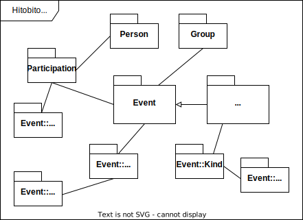

# Composition

Hitobito has a versatile system for managing events (Event) and courses (Event::Course). In pbs and jubla Wagon there is also an extension for camps (Event::Camp).

Many event features are customised in the wagons, this documentation mainly refers to the features in the core and partly describes the existing wagon extensions.
