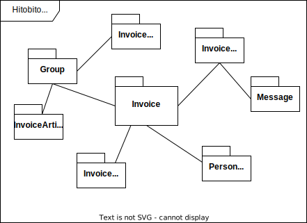
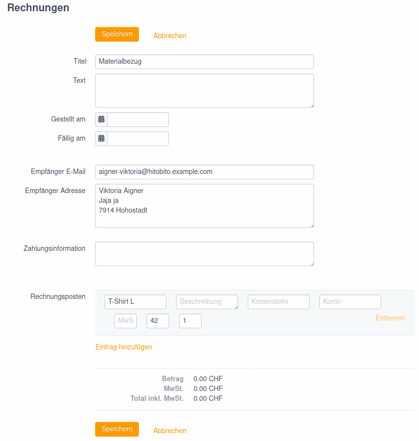
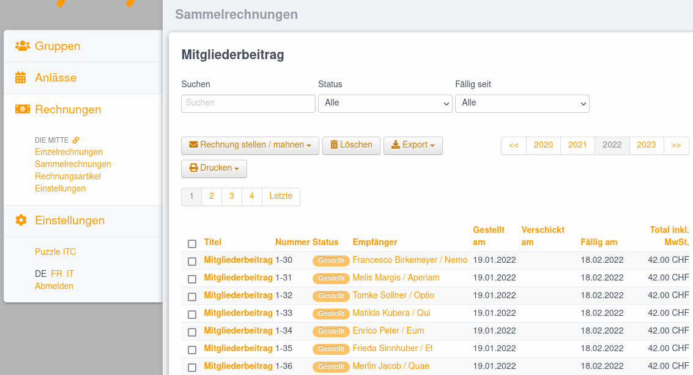

# Invoices

## Overview
* [User](#user)
* [Invoice](#invoice)
* [Config](#invoiceconfig)
* [Article](#invoicearticle)
* [List](#invoicelist)
* [Ebics Connection](ebics-connection.md)
* [Dynamic Invoice](dynamic_invoice_items.md)

## Composition

Hitobito's invoice feature can be used to issue invoices to individuals and companies.

* **Invoice:** Simple invoice with one or more items. Can be created for a person, an event, a group or via subscription
* **Letter:** A simple letter, without invoice part. Is created via the subscription. See [Messages](../messages/README.md).
* **Invoice letter:** A letter combined with an invoice. Is created via the subscription.

QR invoices can be tested in a simple way with https://www.swiss-qr-invoice.org.

## User

For a person to be able to use the invoice feature, they must have a role with :finance permission on a layer/group. In some wagons this role is called ‘cashier’.

List of invoices](_diagrams/invoices-list.png)

Invoices are issued to persons/companies and can be created via the following workflows:

* On the person list of a group via the ‘+ Create invoice’ button. An invoice is created for each person within the group.
* On the person page (Person#show) via the ‘+ Create invoice’ button. The invoice is only issued to the selected person.
* Via subscription and invoice letters. A collective invoice is created for all recipients of the subscription with a valid address.

## `Invoice`

The central model represents the invoice itself, belongs to a group and a person entry and contains one or more invoice items (`InvoiceItem`).

## `InvoiceConfig`

The invoice settings are managed per layer and can be found in the main navigation under **Invoices**. Settings such as sender address, account details and reminder texts can be made here.

## `InvoiceArticle`

The invoice articles can be managed in the main navigation under **Invoices**. These articles can then be inserted when creating an invoice.

## `InvoiceList`

Collective invoices are used to create an invoice for several people. The collective invoices created can be found in the main navigation under **Invoices**.

### `Message::LetterWithInvoice`

In addition to letters, [invoice letters](../messages/README.md#messageletterwithinvoice) can be created for recipients for subscriptions (MailingList). The `Message::LetterWithInvoice` entry is linked to a collective invoice `InvoiceList`.
