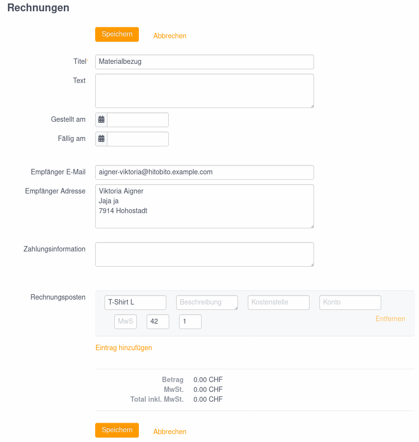

# User

For a person to be able to use the invoice feature, they must have a role with :finance permission on a layer/group. In some wagons this role is called ‘cashier’.

List of invoices](_diagrams/invoices-list.png)

Invoices are issued to persons/companies and can be created via the following workflows:

* On the person list of a group via the ‘+ Create invoice’ button. An invoice is created for each person within the group.
* On the person page (Person#show) via the ‘+ Create invoice’ button. The invoice is only issued to the selected person.
* Via subscription and invoice letters. A collective invoice is created for all recipients of the subscription with a valid address.

