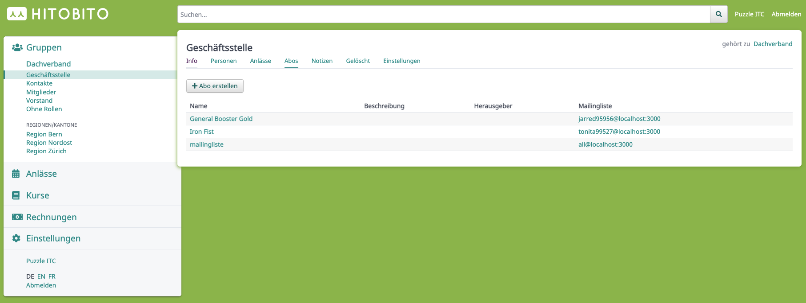
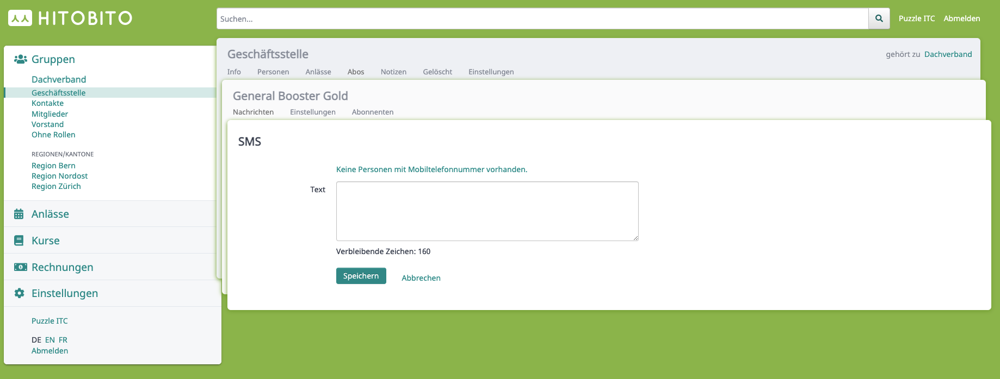
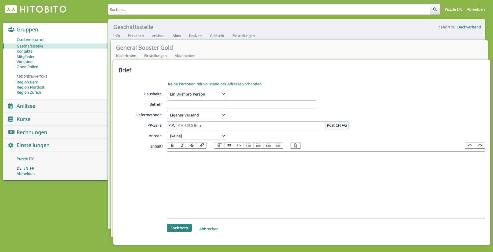
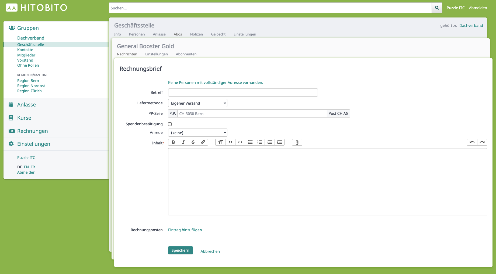

# Messages

## Overview
* [Subscription](#subscription)
* [Message](#message)
* [Distribution](#message)

## Composition

With Hitobito, messages (letters, SMS, mails, etc...) can be sent to various recipients via subscriptions.

## Subscription

Class diagram messages module.

_View of the subscriptions of a group_

### E-mail
[Detailed documentation](e-mail/README.md)

### `Person`
Person is the central model in Hitobito for persons and companies. The contact data relevant for the message module such as e-mail, telephone number or postal address are also stored on the person.

### `MailingList`
The subscription (MailingList) is one of the central elements in the Messages module. Subscriptions are used to define the recipients on a subscription. Subscribers can be groups and specific roles as well as individual persons.

### `MessageRecipient`
The `MessageRecipient` is created in the `Dispatch` as soon as a message is sent. This consists of the persons and the message which are sent. Each `MessageRecipient` also receives a status in which the respective status of the dispatch can be viewed. If a dispatch fails, the status can be used to see which people have not yet received a message.

## Message

Class diagram of the message types

The message model defines the different message types of Hitobito (Single Table Inheritance [STI](https://api.rubyonrails.org/classes/ActiveRecord/Inheritance.html)):

| STI Model | Description |
|------------------------|-------------------|
| `Message::TextMessage` | Text Message (SMS) |         
| `Message::Letter` | Letter |         
| `Message::LetterWithInvoice` | Invoice letter |         
| `Message::BulkMail` | Mail |         
| `Message::BulkMailBounce` | Bounce mail of a previously sent BulkMail |

### `Message::TextMessage`

View of a new SMS message

This type is an SMS (text message) and is sent to a person if they have a mobile number.

### `Message::Letter`

View of a new letter

Letter for mailing which is rendered as a PDF.

### `Message::LetterWithInvoice`

View of a new invoice letter

Letters with additional invoice options (invoice items).

### `Message::BulkMail`
Mail message which is sent to a subscription via an external mail programme.

### `Message::BulkMailBounce`
If a bulk mail is bounced at the target server, it is sent back to the original sender of the bulk mail. A BulkMailBounce entry is created for this purpose.

## Dispatch
The dispatcher is responsible for sending the corresponding message type.

### `Messages::DispatchJob`
The generic DispatchJob (DelayedJob) for all message types is used to send the messages.

### `TextMessageDispatch`
When sending via SMS, all recipient numbers are first collected and stored in the MessageRecipients. Then the dispatch takes place via an HTTP Api from Aspsms. A short time later, the acknowledgements of receipt are retrieved via a separate HTTP Api call and the MessageRecipient is updated accordingly with the status.

### `LetterDispatch`
Generates all MessageRecipient entries with the postal address of the recipient. A corresponding PDF is then generated based on these entries.

### Print shop
A print shop has its own access to Hitobito and can therefore download letters for dispatch as PDFs.
