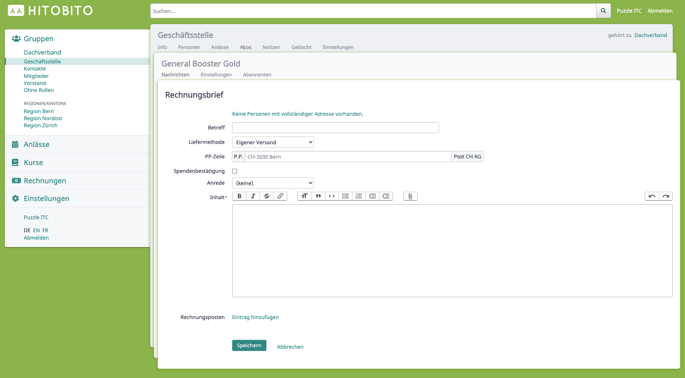

# Message

Class diagram of the message types

The message model defines the different message types of Hitobito (Single Table Inheritance [STI](https://api.rubyonrails.org/classes/ActiveRecord/Inheritance.html)):

| STI Model | Description |
|------------------------|-------------------|
| `Message::TextMessage` | Text Message (SMS) |         
| `Message::Letter` | Letter |         
| `Message::LetterWithInvoice` | Invoice letter |         
| `Message::BulkMail` | Mail |         
| `Message::BulkMailBounce` | Bounce mail of a previously sent BulkMail |

## `Message::TextMessage`

View of a new SMS message

This type is an SMS (text message) and is sent to a person if they have a mobile number.

## `Message::Letter`

View of a new letter

Letter for mailing which is rendered as a PDF.

## `Message::LetterWithInvoice`

View of a new invoice letter

Letters with additional invoice options (invoice items).

## `Message::BulkMail`
Mail message which is sent to a subscription via an external mail programme.

### `Message::BulkMailBounce`
If a bulk mail is bounced at the target server, it is sent back to the original sender of the bulk mail. A BulkMailBounce entry is created for this purpose.
