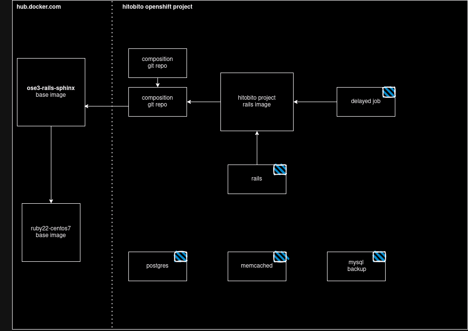

# Hitobito @ Openshift

| Container    | Beschreibung                         | Image |
|--------------|--------------------------------------| --- |
| rails        | Apache, Passenger, Rails Applikation | Projekteigenes rails Image |
| delayed-job  | Delayed Job Worker                   | Projekteigenes rails Image |
| postgres     | Postgres DB Server                   | postgres:16, https://github.com/docker-library/postgres/blob/3a94d965ecbe08f4b1b255d3ed9ccae671a7a984/16/bookworm/Dockerfile |
| mysql-backup | Mysql DB Backup                      | appuio/mysql-simple-backup-container, https://hub.docker.com/r/appuio/mysql-simple-backup-container/ |
| memcached    | Memcached Server                     |  |

## Composition Repository

Welcher Source-Code vom Core und den Wagons deployed wird, wird über die ose-composition repos definiert.

### Neu

Als erstes wird ein neues Repo auf Github erstellt. z.B. github.com/hitobito/ose_composition_generic

    NAME=myproject
    git clone https://github.com/hitobito/ose_composition_template ose_composition_$NAME
    git submodule update --init
    git remote set-url origin https://github.com/hitobito/ose_composition_$NAME.git

In diesem Repo gibt es standardmässig die Branches *production* und *devel*. Weitere Branches können natürlich nach Bedarf erstellt werden. Ersterer ist für stabile, produktive Umgebungen gedacht. Der *devel* ist für Continous Integration während der Entwicklung angedacht.

Nun werden die gewünschten Wagons hinzugefügt:

    git submodule add https://github.com/hitobito/hitobito_$MY_WAGON_REPO.git

Dann wechselt man in den Core und die Submodule und checked den gewünschten Stand/Branch aus. Danach erfolgt ein Commit im Composition Repo selber welcher die gewünschten Revisions der Submodules beinhaltet.

### Bestehendes Comp-Repo auschecken

Um ein bestehendes Compositon Repo auszuchecken:

    git clone --recurse-submodules https://github.com/hitobito/ose_composition_cevi.git -b production

## Neues Projekt

Install oc client first: https://github.com/openshift/origin/releases

Als erstes wird ein neues Projekt auf Openshift angelegt:

    project=my-hitobito
    oc new-project $project

---- notes

* containers (rails, delayed-job, memcached, postgres, mysql-backup
* jenkins deployment job
